<div align="center">

# 🚀 Production RAG Agent

### Enterprise-Grade Retrieval-Augmented Generation (RAG) Platform

Build AI-powered knowledge assistants capable of ingesting, indexing, retrieving, and reasoning over your documents using **Google Gemini**, **LangGraph**, **FastAPI**, **Next.js**, **PostgreSQL**, and **Qdrant**.

<p>


</p>

</div>

---

<p align="center">
  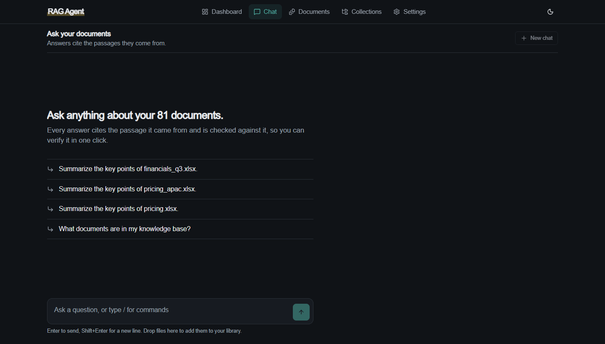
</p>

<p align="center"><i>A real query against the running stack: the agent retrieves, grades and answers, the answer is checked against its sources, and the citation opens the passage with the supporting sentence highlighted.</i></p>

---

# 📊 Results

Every retrieval or generation change is measured on a 62-case golden set (`backend/evals/datasets/golden_v1.jsonl`)
through the real `/query` endpoint. Numbers come from result files in `backend/evals/results/`; rows fill in as each
change is measured, and a change that does not help is reported as such.

| Configuration | recall@5 | MRR | faithfulness | citation acc. | p50 latency |
|---|---|---|---|---|---|
| Baseline (dense only) | 0.745 | 0.670 | 0.967 | 0.700 | 3.9 s |
| + query rewriting | 0.894 | 0.846 | 0.952 | 0.833 | 3.1 s |
| + hybrid search (default) | 0.936 | 0.926 | 0.968 | 0.841 | 3.2 s |
| + cross-encoder rerank (off by default)¹ | 0.978 | 0.967 | 0.982 | 0.822 | 6.9 s |
| + identifier pinning² | 1.000 | 0.938 | 0.984 | 0.872 | 2.7 s |
| + agentic self-correction (default)³ | 1.000 | 0.989 | 0.984 | 0.848 | 8.7 s |

Every row except the rerank side-measurement adds to the one above and is a full judged run (`jd_*` and `ag_*` result
files, the same flash-lite judge throughout). ¹ Rerank helps retrieval but adds ~3.5 s p50 on CPU (p95 32 s under load),
so it ships disabled; 6 of 62 cases in that run hit the Gemini free-tier quota and are excluded from its averages.
² BM25's top hit is kept for queries containing an error code, SKU or version (RRF was fusing exact matches out of the
top 5). ³ **Most of the accuracy gain came from pinning, not from the agent.** Against the pinning-only run the agent
changes: faithfulness 0.984 → 0.984, refusal correctness 0.984 → 1.000 (one chitchat question), citation accuracy
0.872 → 0.848, context precision 0.537 → 0.738, chitchat answered without a search 2/7 → 7/7, and latency p50 2.7 s →
8.7 s, p95 4.3 s → 35 s, at about 2,160 LLM tokens per query. It stays on by default for the cleaner context and the
chitchat shortcut; `ENABLE_AGENTIC_LOOP=false` (with the two flags beside it) is the fast path and keeps the
accuracy shown in the pinning row.

Baseline weak spots (recall@5 by category) were exact terms 0.583 and follow-up questions 0.300, against 1.000 for factual
and multi-hop lookups; with the final configuration both reach 1.000 (`ag_full4`). Corpus: ~90 chunks of synthetic documents
with deliberately look-alike identifiers (near-identical error codes and SKUs), so retrieval is not trivially easy.

---

# 📖 Overview

Production RAG Agent answers questions about your own documents and shows its evidence. Upload PDFs, Office files,
spreadsheets, text or images; ask in plain language; every answer cites the passages it came from, is checked against
them, and opens the supporting sentence in one click.

It started as a FastAPI + Next.js + Postgres + Qdrant + Gemini + LangGraph app with a linear retrieve-and-generate
pipeline. This repository takes it further and measures every step: an evaluation harness with a golden set, query
rewriting, hybrid (dense + BM25) search, an agentic LangGraph with a capped self-correction loop and verified
citations, a redesigned interface, and observability (metrics, traces, a feedback loop). [PROGRESS.md](PROGRESS.md)
records each iteration with the numbers behind it.

---

# ⭐ Highlights

- **Measured, not assumed:** 62-question golden set, retrieval and LLM-judged metrics, results table above
- **Hybrid search:** dense + BM25 fused with Reciprocal Rank Fusion; exact codes and SKUs stay findable
- **Agentic graph:** router, chunk grading, capped retry loop, groundedness check, verified citations
- **Evidence-first UI:** citation chips, a margin of supporting sentences, streaming status, dark mode
- **Observability:** Prometheus metrics, Grafana dashboard, Langfuse traces, thumbs feedback turned into eval cases
- **Resilient ingestion:** deterministic chunk ids, duplicate detection, resumable indexing, embedding retries
- **Runs with one command:** `docker compose up --build` (API, Postgres, Qdrant, web app)
- **CI:** lint, types, unit tests and a frontend build on every push; a smoke eval on pull requests

---

# ✨ Features

## 📂 Document processing

PDF, Word, PowerPoint, Excel, CSV, Markdown, plain text, JSON and logs, plus images (read with OCR). Each file is
validated, parsed, chunked, embedded and indexed; re-uploading the same file is detected and skipped.

## 🧠 Chunking

Block-aware recursive splitting with configurable size and overlap (`MIN_CHUNK_SIZE`, `MAX_CHUNK_SIZE`,
`CHUNK_OVERLAP`), deterministic chunk ids (so evals can name the right chunk and re-indexing is idempotent), and
resumable indexing after a crash.

## 🤖 Question answering

1. The **router** sends greetings and clarifications straight to a short reply with no search.
2. Follow-up questions are **rewritten** into standalone search queries using the conversation.
3. **Hybrid retrieval** combines dense and BM25 results; an exact error code, SKU or version keeps its best lexical match.
4. **Chunk grading** drops irrelevant passages and, when results are weak, retries with a different query (at most twice).
5. Gemini writes the answer as **structured output**: claims with source ids, which the server validates.
6. A **groundedness check** flags answers the sources do not support.

Every step is behind a flag and fails open to the plain pipeline.

## 💬 Chat

Streaming answers with a live status line, conversation memory, inline citation chips, a margin of supporting
sentences, the full retrieved passages ("show raw context"), copy, regenerate and thumbs up/down with an optional
comment, `/new` and `/upload` commands, drag-and-drop upload onto the composer, and example questions drawn from your
own documents.

## 📁 Library and collections

Upload with progress and duplicate detection, a paged document list, optimistic delete with confirmation, and
collections that scope a question to a chosen set of documents.

## 🩺 Dashboard and settings

A one-line library summary, recently added files, and service status (API, Gemini, PostgreSQL, Qdrant).

> **Note:** On the Gemini free tier, very large documents can take several minutes to embed because of provider quota
> limits; ingestion is synchronous (see Known limitations).

---

# 🏗 Architecture

```
                     User
                       │
                       ▼
             Next.js Frontend
                       │
             REST / Streaming API
                       │
                       ▼
               FastAPI Backend
                       │
       ┌───────────────┼───────────────┐
       │               │               │
       ▼               ▼               ▼
 Google Gemini     PostgreSQL      Qdrant
      │             Metadata     Vector Store
      └───────────────┬───────────────┘
                      ▼
                 LangGraph RAG
```

## Agent graph

Generated from the compiled LangGraph (`_compile_graph().get_graph().draw_mermaid()`). Dashed edges are
conditional. The router sends chitchat and clarification requests straight to `direct_response` with no retrieval;
`grade_chunks` sends weak results back to `rewrite_query` for at most `MAX_RETRIEVAL_LOOPS` retries; `check_grounded`
appends a visible caveat when the answer is not supported by the retrieved sources. Each step is behind a flag
(`ENABLE_AGENTIC_LOOP`, `ENABLE_GROUNDEDNESS_CHECK`, `ENABLE_VERIFIED_CITATIONS`) and fails open.

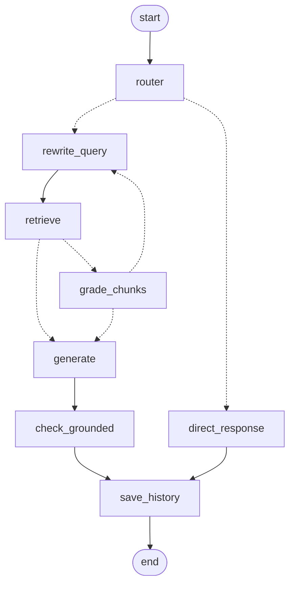

---

# ⚙ Technology Stack

| Layer | Technology |
|---|---|
| Web app | Next.js 15, React 19, TypeScript, Tailwind CSS 4, Radix UI, next-themes, cmdk |
| API | FastAPI, async SQLAlchemy, Pydantic, Alembic |
| AI | Google Gemini (answers, embeddings, judge), LangGraph, fastembed (BM25 and a local cross-encoder) |
| Data | PostgreSQL (documents, conversations, feedback), Qdrant (dense + sparse vectors) |
| Quality | pytest, ruff, mypy, a custom eval harness, GitHub Actions |
| Observability | Prometheus, Grafana, Langfuse (self-hosted) |
| Packaging | Docker, Docker Compose |

---

# 🧭 Engineering decisions

**Reciprocal Rank Fusion instead of score normalisation.** Dense cosine similarity and BM25 scores live on
unrelated scales, and BM25's range shifts with the query length and the corpus statistics. Normalising and
adding them needs a weight that has to be re-tuned whenever the corpus changes. RRF (k = 60) only uses ranks, so
it has no parameter worth tuning, and it is what lifted exact-term questions (error codes, SKUs): recall@5 for
that category went from 0.583 to 0.750 with hybrid on, and overall recall@5 from 0.894 to 0.936, for about 4 ms of
extra retrieval time. The score floor and gap cut-off still run on the dense cosine score after fusion, because
that is the only score with a stable meaning.

**A local cross-encoder instead of a paid rerank API, and off by default.** Reranking is pluggable
(`RERANKER_PROVIDER`), and the local `ms-marco-MiniLM-L-6-v2` keeps queries and document text on the machine
with no per-call cost. It measurably helps (recall@5 0.936 → 0.978, MRR 0.926 → 0.967) but adds about 3.5 s p50 on
this laptop's CPU, far over the ~150 ms budget, so it ships behind `ENABLE_RERANKING`. On a GPU or with a hosted
reranker the trade changes; the flag and the eval harness make that a measurement rather than a debate.

**The retrieval loop is capped.** The agent grades what it retrieved and may rewrite the query and search again,
at most `MAX_RETRIEVAL_LOOPS = 2` times. An uncapped loop turns one bad question into unbounded LLM spend. The
cap is enforced in the graph and covered by a test in which the grader always answers "weak". The first version
also threw away a good first retrieval when a retry drifted; the final context is now chosen across all
attempts, and retries must keep identifiers such as error codes (see PROGRESS.md, Phase 4).

**Every helper step fails open.** Router, grader, groundedness check, query rewrite, tracing and metrics can each
fail (quota, timeout, malformed JSON) without failing the answer: the pipeline falls back to the plain
retrieve-and-generate path and logs the failure. The helpers use the Gemini SDK's JSON mode, not LangChain chat
models, so their tokens never leak into the streamed answer.

# 🔭 Observability

```bash
docker compose -f docker-compose.yml -f docker-compose.observability.yml up -d
```

* **Metrics:** `GET /metrics` (Prometheus): queries by route and outcome, end-to-end and per-stage latency,
  retrievals per query, LLM tokens by model and step, cost at the prices set in `LLM_PRICE_*_PER_MTOK`, embedding
  requests, retries and 429s, and ingestion throughput. Grafana at http://localhost:3001 ships a provisioned
  "RAG Agent" dashboard.
* **Tracing:** self-hosted Langfuse at http://localhost:3002 (`LANGFUSE_ENABLED=true`): one trace per query with a
  span per graph node, tagged with the active feature flags so configurations can be compared side by side.
* **Feedback loop:** thumbs up/down in the chat UI is stored by `POST /feedback` together with the retrieved chunk
  ids and the active flags. `python scripts/feedback_to_eval.py` turns thumbs-down answers into golden-set
  candidates for human review: production failure → eval case → fix → measured improvement.

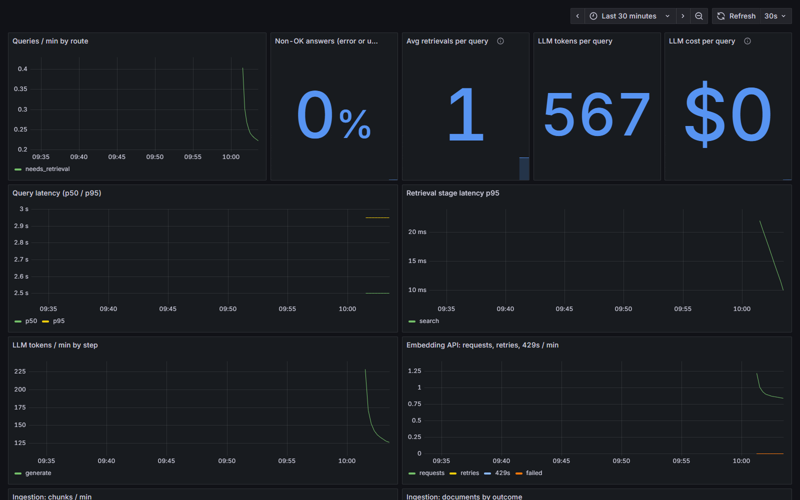

A Langfuse trace of one agent query: the router, rewrite, retrieval (three attempts here), chunk grading,
generation and groundedness spans with timings and token counts, tagged with the active feature flags.

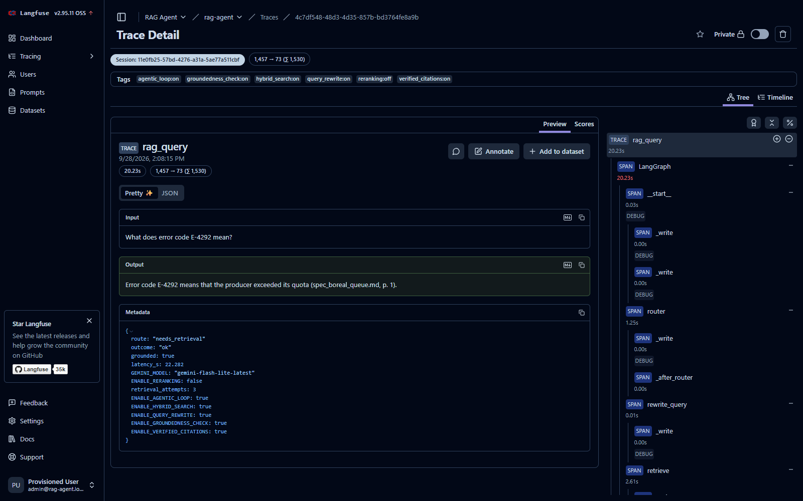

**Cost per query** (measured on the 62-question eval with the agent on): ≈2,040 input + 124 output LLM tokens;
$0 on the Gemini free tier. Multiply the token counts by your plan's per-token prices, or
set `LLM_PRICE_*_PER_MTOK` and read `rag_llm_cost_usd_total` from `/metrics`.

# ⚠️ Known limitations

* **Free-tier Gemini quotas shape everything.** The free tier allows about 500 requests per day per model. A full
  judged run of the agent (about 6 LLM calls per question, including the judge) fits into one day at most, and
  runs must be paced to stay under the per-minute limit. Latency numbers include those retry waits.
* **Slow providers still mean slow answers.** Each LLM call has a 45 s timeout (`LLM_TIMEOUT_S`) and a query
  that has not started answering after `REQUEST_DEADLINE_S` (120 s) ends with a clear error; once the answer
  is streaming it is allowed to finish. Before these bounds, 1 of 62 eval cases took over 300 s.
* **Ingestion is synchronous.** Upload parses, chunks, embeds and indexes inside the request; there is no
  background queue, so the UI cannot show a per-stage progress bar and very large files hold the request open.
* **No authentication or multi-tenancy.** Every user sees every document and collection. Do not expose the API
  publicly.
* **Traces cover LangChain calls in full, SDK helper calls as timings.** Router, grader and groundedness calls go
  through the Gemini SDK directly: their tokens are counted in `/metrics`, and their node spans appear in
  Langfuse, but not as separate LLM generations.
* **The golden set is synthetic** (62 questions over purpose-built documents with look-alike identifiers). It is
  good at catching regressions, not a claim about accuracy on your documents, and retrieval now reaches 1.000
  recall@5 on it, so it no longer separates retrieval changes. It needs harder cases; the feedback loop is how
  real questions get into it.

# 📸 Application Preview

Captured from the production build (`npm run build && npm start`) in light and dark mode; mobile shots at 390 px.

| | Light | Dark |
|---|---|---|
| Dashboard | 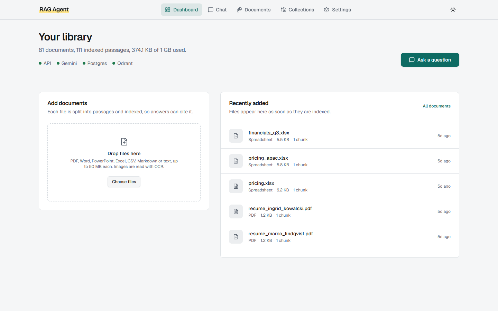 | 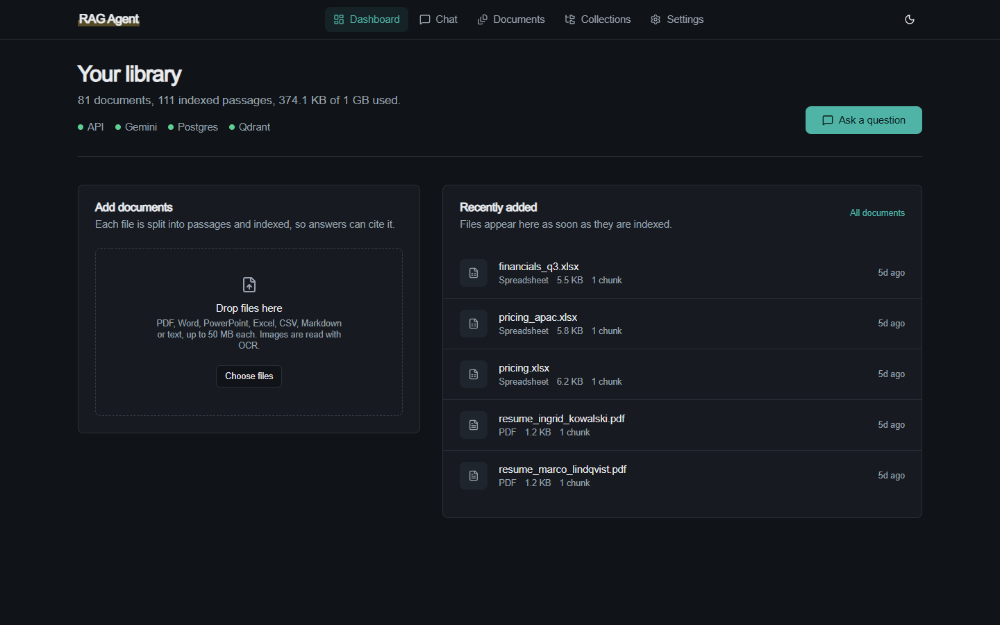 |
| Documents | 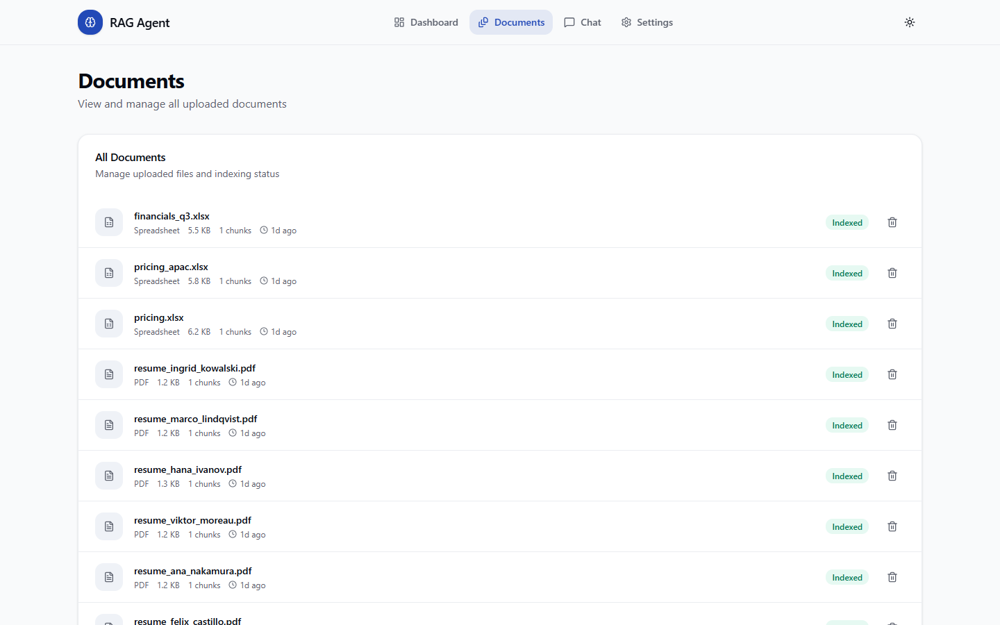 | 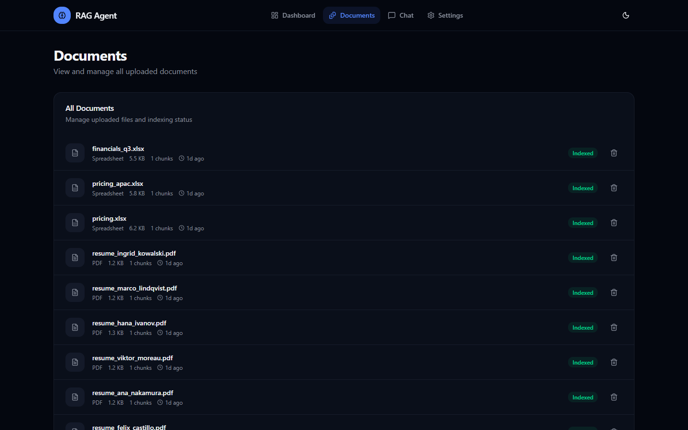 |
| Chat | 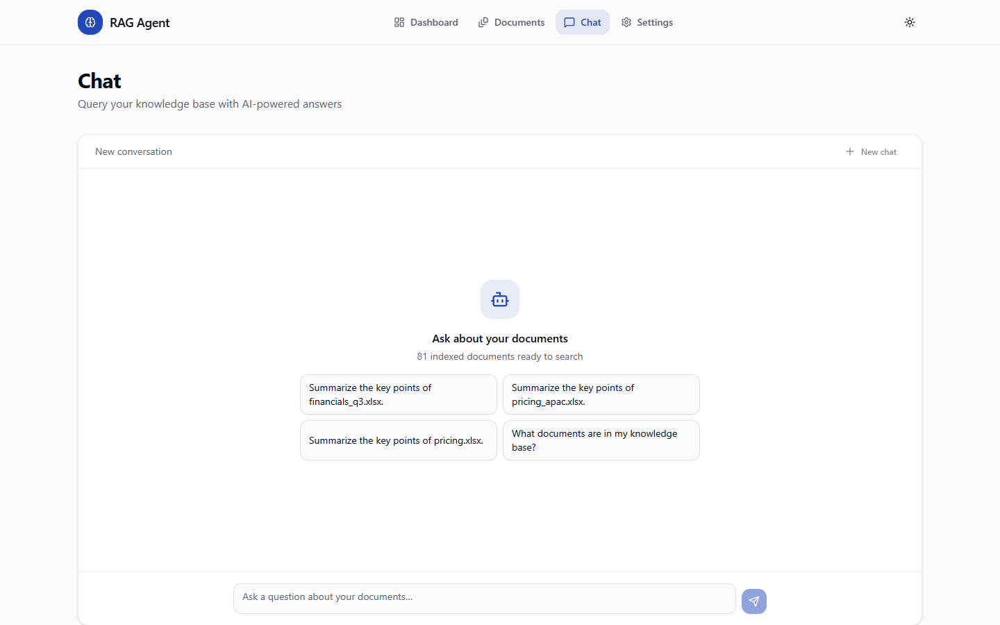 | 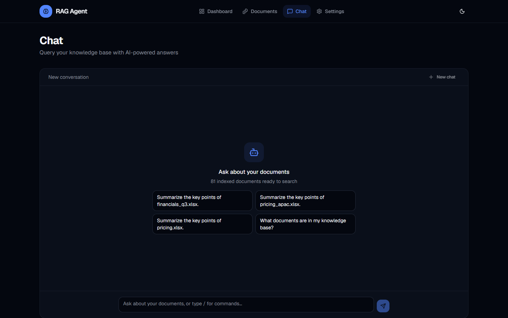 |

<p>
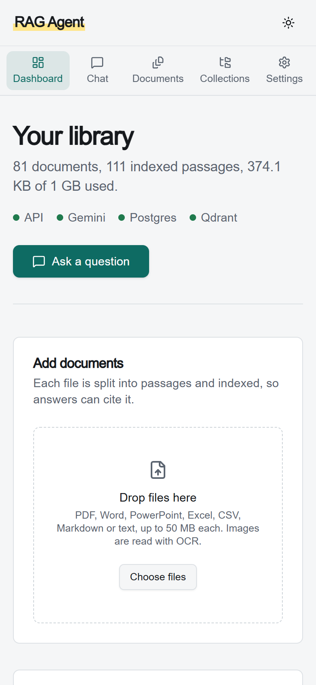
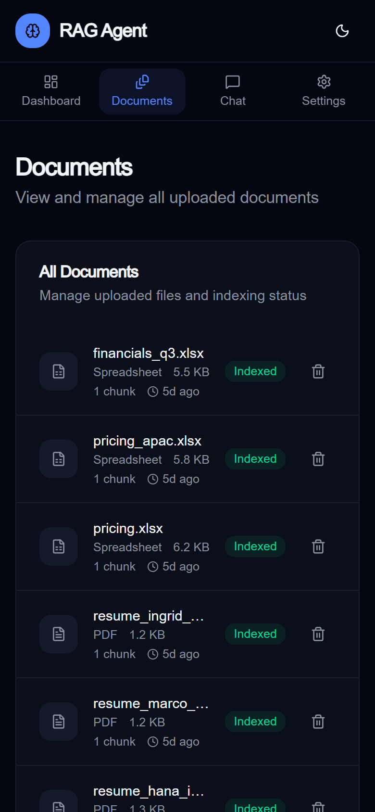
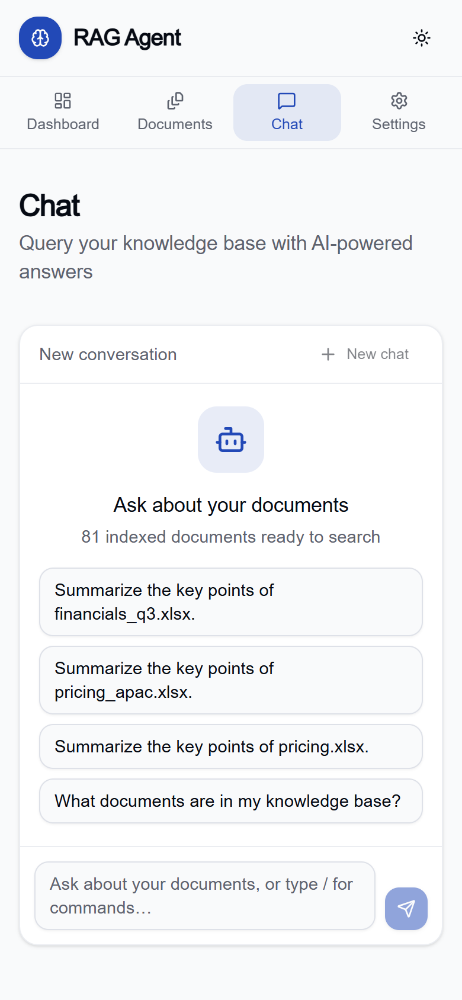
</p>

---

## Lighthouse

Production build (`npm run build && npm start`), median of three runs per page, Lighthouse 12 in headless Chrome
on the development laptop.

| Profile | Page | Performance | Accessibility | Best practices | LCP | CLS |
|---|---|---|---|---|---|---|
| Desktop | /chat | 100 | 100 | 100 | 0.7 s | 0.007 |
| Desktop | /dashboard | 100 | 100 | 100 | 0.6 s | 0.001 |
| Desktop | /documents | 100 | 100 | 100 | 0.6 s | 0.005 |
| Desktop | /collections | 100 | 100 | 100 | 0.7 s | 0.010 |
| Desktop | /settings | 100 | 100 | 100 | 0.6 s | 0.000 |
| Mobile | /chat | 89 | 100 | 100 | 3.0 s | 0.045 |
| Mobile | /dashboard | 88 | 100 | 100 | 3.1 s | 0.099 |
| Mobile | /documents | 88 | 100 | 100 | 2.5 s | 0.000 |
| Mobile | /collections | 92 | 100 | 100 | 2.7 s | 0.022 |
| Mobile | /settings | 91 | 100 | 100 | 2.5 s | 0.004 |

Accessibility and best practices are 100 on every page in both profiles, and mobile performance is 88 to 92 (target
85). Mobile LCP is 2.5 to 3.1 s against a 2.5 s target on the throttled profile, and the dashboard's mobile CLS of
0.099 is just inside the 0.1 limit. Single runs on this laptop swing by 10 to 20 points because its CPU speed varies
(Lighthouse's benchmark index ranged from ~500 to ~1,700), so changes were judged with interleaved A/B runs: paginating
the documents list cut mobile blocking time from 1,083 to 657 ms; switching to the Geist font was neutral.

---

# 🚀 Getting Started

## Run everything with Docker

```bash
git clone https://github.com/coderheist/RAG-KNOWLEADGE-AGENT-.git
cd RAG-KNOWLEADGE-AGENT-

cp backend/.env.example backend/.env      # then set GOOGLE_API_KEY in backend/.env
docker compose up --build
```

| Service | URL |
|---|---|
| Web app | http://localhost:3000 |
| API and Swagger docs | http://localhost:8000/docs |

Upload a document on the dashboard, then ask about it in Chat. Every setting is documented in
`backend/.env.example`.

## Develop the web app without Docker

```bash
cd backend && docker compose up --build postgres qdrant backend   # API on :8000
cd .. && cp .env.example .env && npm install && npm run dev       # web app on :3000
```

## Observability (optional)

```bash
cd backend
docker compose -f docker-compose.yml -f docker-compose.observability.yml up -d
```

Grafana http://localhost:3001, Prometheus http://localhost:9090, Langfuse http://localhost:3002 (set the
`LANGFUSE_*` values in `backend/.env`; `LANGFUSE_ENABLED=true` turns tracing on).

## Tests and evaluation

```bash
cd backend
pytest tests -q -m "not integration"               # unit tests (CI runs these)
python -m evals.setup_corpus --dataset golden_v1   # index the fixture corpus (needs the stack and a key)
python -m evals.run_eval --dataset golden_v1 --tag mytry --compare baseline
```

`--no-judge` scores retrieval only (no LLM judge calls); `--delay` paces requests for rate-limited keys. Results
are written to `backend/evals/results/`.

---

# 📂 Project Structure

```
├── app/, components/, lib/     Next.js web app (App Router)
├── Dockerfile                  web app image
├── docker-compose.yml          root entry point (includes backend/docker-compose.yml)
├── backend/
│   ├── app/
│   │   ├── api/                routes: /query (SSE), /upload, /documents, /collections, /feedback, /health, /metrics
│   │   ├── services/           rag_graph, retrieval, fusion, reranking, agent steps, citations, tracing, metrics
│   │   └── db/, schemas/       models and request/response types
│   ├── evals/                  golden set, metrics, runner, recorded results
│   ├── scripts/                reindex_hybrid.py, feedback_to_eval.py
│   ├── observability/          Prometheus and Grafana configuration, dashboard JSON
│   ├── docker-compose.yml, docker-compose.observability.yml
│   └── tests/
├── docs/                       screenshots and demo GIF
├── PROGRESS.md                 iteration log with every number's source
└── .github/workflows/          CI and the pull-request smoke eval
```

---

# 🔥 Production Engineering Features

✅ Evaluation harness with a golden set and a CI smoke eval

✅ Hybrid search with Reciprocal Rank Fusion and a rollout guard for older collections

✅ Capped agentic loop, per-call timeouts and a request deadline

✅ Verified citations (source ids checked against what was retrieved)

✅ Deterministic chunk ids, duplicate detection, resumable indexing

✅ Embedding retries with exponential backoff and jitter

✅ Metrics, traces and a feedback loop into new eval cases

✅ Accessibility 100 and best practices 100 (Lighthouse), light and dark themes

✅ One-command Docker deployment

---

# 📈 Roadmap

- [x] Automated evaluation suite
- [x] CI/CD pipeline
- [x] Observability dashboard
- [ ] Background workers and an async upload queue (with per-stage progress)
- [ ] Authentication, multi-tenancy and role-based access control
- [ ] A harder, larger golden set grown from real feedback
- [ ] Redis cache
- [ ] Kubernetes deployment

---

# 🎯 Learning Objectives

This project demonstrates practical experience with:

- Retrieval-Augmented Generation (RAG)
- AI Engineering
- Vector Databases
- Semantic Search
- LangGraph Workflows
- Google Gemini APIs
- Production FastAPI Development
- Full Stack AI Applications
- Docker Deployment
- Enterprise Software Architecture

---

# 🤝 Contributing

Contributions are welcome!

If you'd like to improve the project:

1. Fork the repository
2. Create a feature branch
3. Commit your changes
4. Open a Pull Request

---

# 📄 License

This project is licensed under the MIT License.

---

# 👨‍💻 Credits

This repository builds on the open-source **Production RAG Agent** by **Rounak Kumar Sah** (original ingestion
pipeline, FastAPI backend and Next.js app). The evaluation harness, query rewriting, hybrid search, agentic graph,
interface redesign, observability and CI described above were added on top; PROGRESS.md logs each step.


---

<div align="center">

⭐ If you found this project useful, please consider giving it a Star.

</div>
